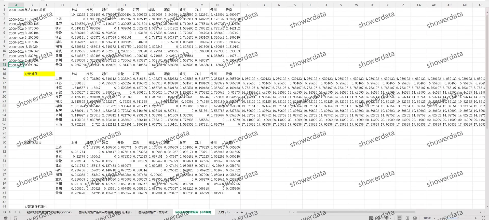
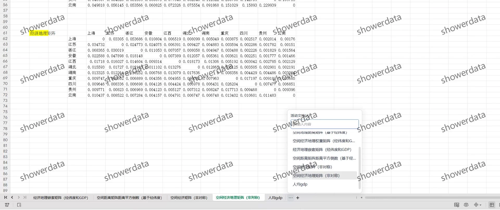
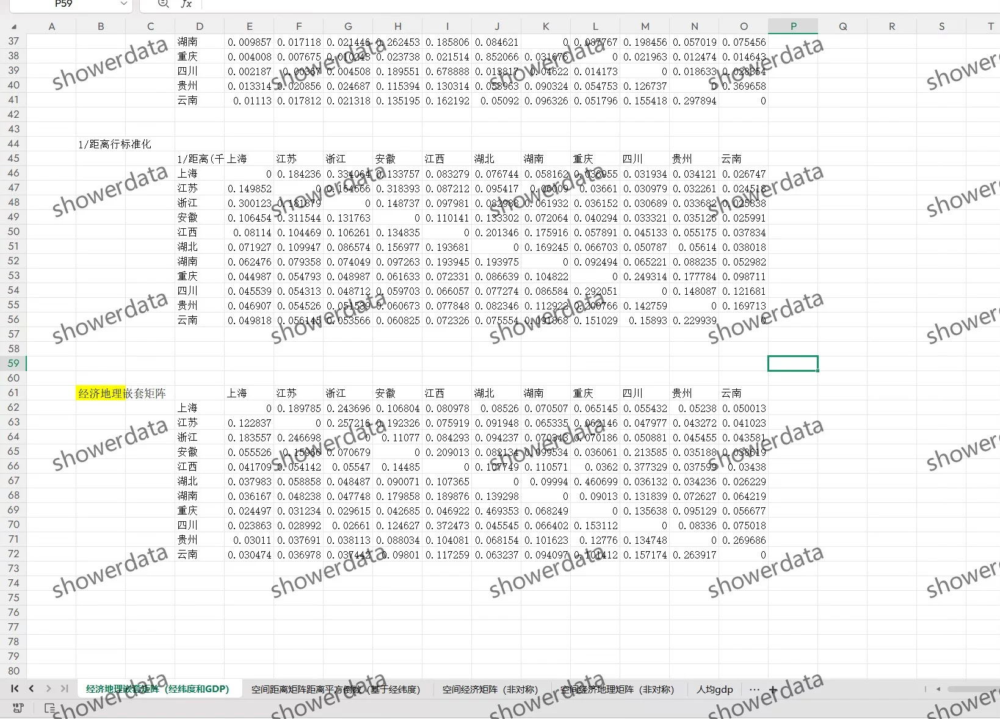

## Body

【数据介绍】
（1）数据详情：见下方图片，拍前请看清楚！已完整展示说明，请确定好是不是自己需要的再拍下！发货后任何理由不退不换！
（2）数据名称：长江经济带省级权重矩阵
（3）样本范围：2000-2024年，11个省
（4）数据格式：excel
（5）数据内容：01矩阵 、经济矩阵、地理矩阵、地理倒数平方矩阵、经济地理矩阵以及经济地理嵌套矩阵、非对称矩阵等，具体如图（excel计算，内含原始数据和计算过程，经济矩阵分年份，其他不分年份，非每一年计算好的，需要自己修改研究区间）

## Images

Here is a pay link on Stripe ( https://buy.stripe.com/3cs8yP7sY87d0vu9AB ). Please contact me lonlonago@foxmail.com after funding $89, and I will send you a complete data files , thank you!

